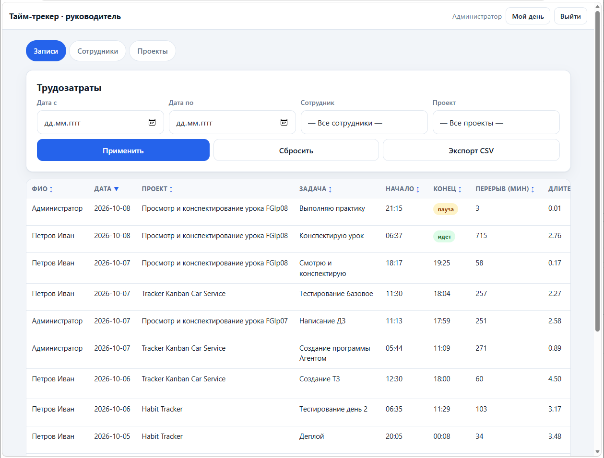

# Тайм-трекер — учёт рабочего времени сотрудников

Лёгкая веб-система тайм-трекинга: сотрудник отмечает начало/окончание работы
и трудозатраты по задачам, руководитель видит сводку по всем сотрудникам,
фильтрует, сортирует, считает сумму к оплате и выгружает CSV.

**Стек:** Python 3.10+ · Flask · SQLite · чистые HTML5/CSS3/JS (без фреймворков).

---

## 1. Возможности

**Сотрудник (мобильный интерфейс, ввод одной рукой):**

* большая кнопка **«Начать работу»** — запуск таймера (текущее время подставляется автоматически);
* список **незавершённых записей за сегодня** и кнопки «Пауза» / «Завершить»;
* **ручной ввод**: дата, проект (справочник), задача, начало, окончание, перерыв (мин), примечания;
* клиентская валидация: окончание должно быть позже начала (отдельный флаг — «смена через полночь»);
* свои записи за сегодня с итогом в часах, удаление ошибочной записи.


**Руководитель (Admin Dashboard):**

* таблица **всех** записей: ФИО, Дата, Проект, Задача, Начало, Конец, Перерыв (мин),
  Длительность (часы, формат `1.50`), К оплате, Примечания + колонка «Действия»
  (удаление любой записи);
* фильтры: диапазон дат, сотрудник, проект;
* сортировка по любому столбцу (стрелки в шапке);
* **Итого к оплате** = Σ (Длительность × Ставка) по отфильтрованной выборке;
* экспорт текущей выборки в **CSV**;
* справочники: **Проекты** (добавить/редактировать/деактивировать/удалить,
  если по проекту нет записей)
  и **Сотрудники** (ФИО, логин, роль, ставка руб/час, пароль, активность).



**Расчёт длительности** выполняется на сервере:

```
Длительность = (Время_окончания − Время_начала) − Перерыв / 60      → округление до 2 знаков
```

Переход через полночь поддерживается: если окончание меньше начала
(например, `22:00 → 02:00`), считается, что работа закончилась на следующий день → **4.00 ч**.

---

## 2. Выбранная архитектура

```
┌───────────────────────────────┐        ┌──────────────────────────────┐
│  frontend/  (чистые HTML/CSS/JS) │  HTTP  │  backend/  (Flask, Python)     │
│  login.html / index.html /      │◄──────►│  auth.py      — вход, сессии    │
│  admin.html + js/*.js           │  JSON  │  records.py   — CRUD записей    │
│  вывод только через textContent │        │  admin.py     — панель админа   │
└───────────────────────────────┘        │  security.py  — роли/доступ     │
                                          │  duration.py  — расчёт часов    │
                                          └──────────────┬───────────────┘
                                                         │ параметризованные SQL
                                              ┌──────────▼──────────┐
                                              │  SQLite  data.db    │
                                              │  users / projects / │
                                              │  records            │
                                              └─────────────────────┘
```

**Почему SQLite, а не Google Sheets:** файл `data.db` не требует сервисного
аккаунта, квот и сети, работает офлайн, деплой = один процесс, а транзакции и
целостность данных обеспечивает сама БД. Интеграция с Google Sheets опциональна
и описана в [Приложении A](#приложение-a-провайдер-google-sheets-опционально).

### Структура репозитория

```
├── main.py                # точка входа: python main.py
├── requirements.txt       # flask, bcrypt, python-dotenv, gunicorn
├── .env.example           # шаблон переменных окружения
├── .gitignore             # .env, data.db, credentials.json, …
├── README.md
├── backend/
│   ├── app.py             # фабрика приложения, страницы, обработка ошибок
│   ├── auth.py            # /api/auth/* : login, logout, setup, статус
│   ├── records.py         # /api/records/* : CRUD, старт/стоп таймера
│   ├── admin.py           # /api/admin/* : записи всех, сотрудники, проекты
│   ├── security.py        # роли, декораторы доступа, текущий пользователь
│   ├── duration.py        # расчёт длительности (в т.ч. через полночь)
│   ├── reference.py       # /api/projects — справочник для форм
│   ├── db.py              # соединение, init_db, параметризованные запросы
│   └── wsgi.py            # вход для gunicorn
├── frontend/
│   ├── login.html         # вход + создание первого администратора
│   ├── index.html         # экран сотрудника (mobile-first)
│   ├── admin.html         # панель руководителя
│   ├── css/styles.css     # стили с нуля, без Bootstrap
│   └── js/  api.js app.js admin.js login.js
├── db/schema.sql          # схема + тестовые данные (2 пользователя, 3 проекта)
└── tests/smoke_test.py    # смоук-тесты API (110 проверок)
```

### Схема базы данных (`db/schema.sql`)

| Таблица | Поля | Назначение |
|---|---|---|
| **users** | `id, login (UNIQUE), full_name, role ∈ {admin,user}, rate (руб/час), password_hash (bcrypt), is_active, created_at` | сотрудники и руководители |
| **projects** | `id, name (UNIQUE), is_active, created_at` | справочник проектов |
| **records** | `id, user_id → users, project_id → projects, work_date, task, start_time, started_at, end_time, break_min, notes, duration_hours, paused_seconds, pause_started_at, created_at, updated_at` | трудозатраты; `end_time IS NULL` ⇒ таймер запущен, `pause_started_at NOT NULL` ⇒ на паузе |

Индексы: `records(user_id, work_date)`, `records(work_date)`.

---

## 3. Быстрый старт (локально)

Требуется **Python 3.10+**.

### Windows — запуск в один клик

Дважды кликните **`run.bat`** в корне проекта. Скрипт сам:

1. найдёт Python (и скажет, если его нет);
2. создаст `.venv` и установит зависимости (нужен интернет только при первом запуске);
3. запустит сервер и откроет браузер на `http://127.0.0.1:5000`.

> **Важно:** окно чёрного цвета с надписью `Running on http://127.0.0.1:5000`
> должно оставаться открытым, пока вы работаете в системе. Закрыли окно —
> сервер остановился, и браузер покажет «Не удается открыть эту страницу».
> Не открывайте файлы `frontend/*.html` напрямую — они требуют работающий сервер.

### Вручную (Windows / Linux / macOS)

```bash
# 1. клонируйте/распакуйте проект и перейдите в его корень
cd tracker-time

# 2. виртуальное окружение
python -m venv .venv
# Windows:
.venv\Scripts\activate
# Linux/macOS:
source .venv/bin/activate

# 3. зависимости
pip install -r requirements.txt

# 4. переменные окружения
copy .env.example .env      # Windows
cp .env.example .env        # Linux/macOS

# 5. запуск
python main.py
```

Откройте **http://127.0.0.1:5000** — откроется страница входа.

> Порт, путь к БД и другие настройки задаются в `.env` (см. раздел 6).

### Тесты

```bash
python tests/smoke_test.py
```

110 проверок: аутентификация, изоляция данных между ролями, расчёт длительности
(в т.ч. через полночь и SQL-инъекция), таймер (старт/пауза/остановка), справочники,
удаление записей и проектов, диагностика часового пояса, HTML-страницы.

---

## 4. Как создать первого администратора

Способ **A — через браузер (рекомендуется для локального запуска).**
При пустой базе страница входа автоматически показывает форму
**«Создать учётную запись руководителя»**: ФИО, логин, пароль (от 6 символов).
После создания форма входа больше не появится (создать администратора повторно нельзя).

Способ **B — через `.env` (удобно для деплоя).** Задайте:

```ini
ADMIN_LOGIN=admin
ADMIN_PASSWORD=Очень_Секретный_Пароль
ADMIN_NAME=Иванов Иван Иванович
```

Аккаунт будет создан автоматически при первом запуске (если администратора ещё нет).
**Удалите `ADMIN_PASSWORD` из `.env` после первого входа** — хранить секреты на диске нежелательно.

Способ **C — тестовые данные.** В `.env` установите `SEED_DATA=true` —
будут загружены 2 пользователя и 3 проекта из `db/schema.sql`:

| Логин | Пароль | Роль | Ставка |
|---|---|---|---|
| `admin` | `admin123` | руководитель | — |
| `user` | `user123` | сотрудник | 1500 ₽/ч |

> Пароли в сиде хранятся в виде bcrypt-хеша. Для продакшена `SEED_DATA` оставьте `false`
> и смените пароли в панели руководителя.

**Добавление сотрудников и проектов** выполняется в панели руководителя
(`/admin` → вкладки «Сотрудники» и «Проекты»).

---

## 5. Как пользоваться

**Сотрудник** (`/`):

1. Выбрать проект, вписать задачу → нажать **«Начать работу»**.
2. **«Завершить работу»** (сервер поставит текущее время и посчитает часы),
   **«Пауза»** — приостановить таймер, «Продолжить» — возобновить.
3. Или заполнить форму ручного ввода и нажать «Сохранить».
   Для смены `22:00 → 02:00` отметьте «Смена через полночь».

**Руководитель** (`/admin`):

1. Вкладка **«Записи»** — задайте фильтры (даты, сотрудник, проект) → «Применить».
   Клик по шапке столбца сортирует выборку; внизу — «Итого» и «Итого к оплате».
2. **«Экспорт CSV»** выгружает ровно то, что сейчас показано в таблице.
   Файл кодируется в UTF-8 (BOM), разделитель `;`, дробная часть через запятую —
   корректно открывается в Excel и Google Sheets (RU-локаль).
3. **«Сотрудники»** — добавление, изменение ФИО/роли/ставки/пароля, деактивация.
   *Удаление сотрудника запрещено* (запрос вернёт 403) — чтобы не ломать старые записи.
4. **«Проекты»** — добавление, переименование, деактивация; удаление — только если
   по проекту нет ни одной записи (иначе 409: сначала удалите все записи проекта).

---

## 6. Конфигурация (`.env`)

| Переменная | По умолчанию | Описание |
|---|---|---|
| `SECRET_KEY` | *значение по умолчанию* | **Обязательно замените!** Подпись сессионных cookie: `python -c "import secrets; print(secrets.token_urlsafe(48))"` |
| `DATABASE_PATH` | `./data.db` | путь к файлу SQLite |
| `SEED_DATA` | `false` | `true` — загрузить тестовые данные |
| `ADMIN_LOGIN` / `ADMIN_PASSWORD` / `ADMIN_NAME` | пусто | автосоздание первого администратора |
| `SESSION_COOKIE_SECURE` | `false` | `true` при работе по **HTTPS** (обязательно в проде) |
| `PERMANENT_SESSION_DAYS` | `7` | срок жизни сессии |
| `FLASK_DEBUG` | `false` | только для локальной отладки |
| `HOST` / `PORT` | `127.0.0.1` / `5000` | адрес и порт dev-сервера |
| `TZ` | часовой пояс ОС | пояс расчётов приложения, напр. `Europe/Moscow` |

Файл `.env` и `data.db` добавлены в `.gitignore` — в репозиторий не попадут.

---

## 7. API (кратко)

| Метод | Путь | Доступ | Назначение |
|---|---|---|---|
| GET | `/api/auth/status` | все | авторизация + флаг первого запуска |
| POST | `/api/auth/setup` | только до создания админа | первый администратор |
| POST | `/api/auth/login` · `/logout` | все | вход/выход (httpOnly-кука) |
| GET | `/api/records?date=YYYY-MM-DD` | сотрудник | **только свои** записи за дату |
| POST | `/api/records` | сотрудник | ручной ввод (расчёт на сервере) |
| PUT/DELETE | `/api/records/{id}` | владелец/admin | изменение/удаление |
| POST | `/api/records/start` · `/{id}/pause` · `/{id}/resume` · `/{id}/stop` | сотрудник | таймер |
| GET | `/api/records/running` | сотрудник | текущая запущенная запись |
| GET | `/api/projects` | сотрудник | активные проекты для форм |
| GET | `/api/admin/records?date_from&date_to&user_id&project_id` | **admin** | все записи + `pay` |
| DELETE | `/api/admin/records/{id}` | **admin** | удаление любой записи |
| GET/POST/PUT | `/api/admin/employees[/{id}]` | **admin** | справочник сотрудников |
| GET/POST/PUT | `/api/admin/projects[/{id}]` | **admin** | справочник проектов |
| DELETE | `/api/admin/employees/{id}` | **admin** | всегда **403** — только деактивация |
| DELETE | `/api/admin/projects/{id}` | **admin** | удаляет проект; если в нём есть записи — **409** (сначала удалите записи) |

Ошибки возвращаются как `{"error": "человекочитаемое сообщение"}` + HTTP-код;
фронтенд показывает их в блоке сообщений, без технических крашей.

---

## 8. Безопасность

* **Пароли** — только bcrypt (12 раундов, индивидуальная соль), сравнение через `bcrypt.checkpw`.
* **Сессии** — подписанный cookie `Flask`: `HttpOnly` (недоступен JS), `SameSite=Lax`
  (защита от CSRF), `Secure` по конфигурации. При входе сессия пересоздаётся (анти-фиксация).
* **Изоляция данных** — ID пользователя берётся **только из сессии**; параметр `user_id`
  в URL/query не влияет на выборку. Сотрудник физически не может получить чужую запись:
  запрос вернёт `404`, запрос к `/api/admin/*` — `403` (роль проверяется до чтения данных).
* **SQL-инъекции** — исключены: все запросы идут через `execute(sql, params)`.
* **XSS** — весь вывод создаётся через `textContent` / `createTextNode`;
  `innerHTML` с пользовательскими данными не используется нигде.
* **Перебор пароля** — троттлинг: 10 неудачных попыток с одного IP+логина за 15 минут → `429`.
* **Запрет удаления** — сотрудники только деактивируются (`DELETE` всегда `403`);
  проект удаляется, только если в нём нет записей (иначе `409`);
  нельзя деактивировать себя и последнего активного руководителя.
* **Заголовки** — `X-Content-Type-Options: nosniff`, `X-Frame-Options: DENY`,
  `Referrer-Policy: same-origin`; запросы больше 256 КБ отклоняются.

---

## 9. Деплой

### 9.1 VPS (Ubuntu/Debian), gunicorn + nginx

```bash
# на сервере
sudo apt update && sudo apt install -y python3-venv nginx
git clone <ваш-репозиторий> /opt/tracker && cd /opt/tracker
python3 -m venv .venv && . .venv/bin/activate
pip install -r requirements.txt
cp .env.example .env && nano .env      # SECRET_KEY, ADMIN_*, SESSION_COOKIE_SECURE=true
```

`/etc/systemd/system/tracker.service`:

```ini
[Unit]
Description=Time tracker
After=network.target

[Service]
WorkingDirectory=/opt/tracker
ExecStart=/opt/tracker/.venv/bin/gunicorn -w 2 -b 127.0.0.1:8000 backend.wsgi:app
Restart=always
User=www-data

[Install]
WantedBy=multi-user.target
```

```bash
sudo systemctl enable --now tracker
```

`/etc/nginx/sites-available/tracker`:

```nginx
server {
    listen 80;
    server_name tracker.example.com;

    client_max_body_size 1m;

    location / {
        proxy_pass http://127.0.0.1:8000;
        proxy_set_header Host $host;
        proxy_set_header X-Real-IP $remote_addr;
        proxy_set_header X-Forwarded-Proto $scheme;
    }
}
```

```bash
sudo ln -s /etc/nginx/sites-available/tracker /etc/nginx/sites-enabled/
sudo nginx -t && sudo systemctl reload nginx
sudo certbot --nginx -d tracker.example.com   # HTTPS → и SESSION_COOKIE_SECURE=true
```

> **Важно:** файл `data.db` должен лежать на постоянном диске
> (`DATABASE_PATH=/opt/tracker/data.db`) и попадать в бэкапы:
> `sqlite3 /opt/tracker/data.db ".backup /backup/data-$(date +%F).db"`.

### 9.2 PaaS (Render / Railway / Anywhere)

| Параметр | Значение |
|---|---|
| Build command | `pip install -r requirements.txt` |
| Start command | `gunicorn -w 2 -b 0.0.0.0:$PORT backend.wsgi:app` |
| Env | `SECRET_KEY`, `SESSION_COOKIE_SECURE=true`, `TZ`, `ADMIN_LOGIN`, `ADMIN_PASSWORD`, `DATABASE_PATH=/data/data.db` |
| Disk | подключите **постоянный диск** к пути `DATABASE_PATH` |

Без постоянного диска SQLite-файл будет утрачен при редеплое — для прода
это единственный нюанс. Healthcheck-эндпоинт: `GET /health`.

#### 9.2.1 Пошагово на Railway

1. Залейте проект в GitHub (`.env`, `data.db`, `.venv` уже в `.gitignore`).
2. [railway.com](https://railway.com) → **New Project → GitHub Repository** → выбрать
   репозиторий (тип «Database» не нужен — у нас SQLite-файл внутри сервиса).
3. Файлы `railway.toml` и `nixpacks.toml` в корне уже задают старт-команду
   `gunicorn -w 2 -b 0.0.0.0:$PORT backend.wsgi:app`, healthcheck `/health`,
   установку пакета `tzdata` (нужен для часовых зон) и рестарт при падении —
   руками в настройках сервиса ничего вводить не надо.
4. **Volume (обязательно):** Service → *+ New → Volume*, Mount path `/data`.
5. **Variables** сервиса:

   | Переменная | Значение |
   |---|---|
   | `DATABASE_PATH` | `/data/data.db` |
   | `SECRET_KEY` | `python -c "import secrets; print(secrets.token_urlsafe(48))"` |
   | `SESSION_COOKIE_SECURE` | `true` (HTTPS на `*.up.railway.app`) |
   | `FLASK_DEBUG` | `false` |
   | `SEED_DATA` | `false` |
   | `TZ` | часовой пояс сервера, например `Europe/Moscow` (иначе контейнер живёт в UTC, и таймеры уходят на разницу в часы) |
   | `ADMIN_LOGIN` / `ADMIN_PASSWORD` | логин/пароль первого руководителя (или создайте аккаунт на `/login`) |

6. Deploy → откроется домен вида `....up.railway.app`; зайдите под `ADMIN_LOGIN`
   и создайте сотрудников и проекты.

### 9.3 Windows / macOS, только для локальной сети

```bash
python main.py     # HOST=0.0.0.0 в .env, чтобы открыть с телефона в той же Wi-Fi сети
```

---

## 10. Обработка ошибок

* Все API-ошибки — человекочитаемый JSON `{"error": "..."}` (400/401/403/404/409/429/500).
* HTML-страницы при 400/403/404/500 отдают аккуратную страницу с понятным текстом
  (см. `backend/app.py → _error_page`), а не стек-трейс.
* Нет связи с сервером — фронтенд пишет «Нет связи с сервером…», интерфейс не «падает».
* `FLASK_DEBUG=false` в проде: детали ошибок наружу не утекают.

---

## Приложение A. Провайдер Google Sheets (опционально)

Интеграция **не используется** (выбран SQLite, см. раздел 2). Если понадобится
перейти на Google Sheets как на основное хранилище, план такой:

1. **Создание сервисного аккаунта**
   * [console.cloud.google.com](https://console.cloud.google.com) → создайте проект;
   * *APIs & Services → Library* → включите **Google Sheets API** и **Google Drive API**;
   * *APIs & Services → Credentials → Create Credentials → Service account*;
   * в карточке аккаунта *Keys → Add key → Create new key → JSON* — скачайте файл;
   * переименуйте его в `credentials.json` и положите в корень проекта;
   * создайте таблицу, добавьте листы `Records`, `Users`, `Projects` с колонками из
     раздела «Схема», расшарьте её на адрес сервисного аккаунта
     (`...@...iam.gserviceaccount.com`, роль *Редактор*).

2. **Зависимости и код**
   * Python: `pip install gspread google-auth`, читать через `gspread.service_account(filename="credentials.json")`;
   * Node.js: `npm i googleapis`, авторизация по `GOOGLE_APPLICATION_CREDENTIALS`;
   * `credentials.json` **обязательно** в `.gitignore` (здесь уже добавлен),
     в `.env` — `GOOGLE_APPLICATION_CREDENTIALS=./credentials.json`.

3. **Чтение/запись**
   * панель руководителя: `worksheet.get_all_records()` → JSON фронтенду;
   * новая запись сотрудника: `worksheet.append_row([...])`;
   * при недоступности Google API возвращать `503` с текстом
     «Сервис временно недоступен, данные не сохранены» — пользователь увидит
     понятное сообщение, а не крах.

---

## Частые вопросы

**Забыл пароль администратора.** Остановите сервер и выполните:

```bash
python - <<'PY'
from backend.auth import hash_password
from backend.db import execute
execute("UPDATE users SET password_hash = ? WHERE login = 'admin'", (hash_password("NEW_PASSWORD"),))
print("Готово")
PY
```

**Как перенести данные на другой сервер.** Скопируйте файл `data.db`
(или `sqlite3 data.db ".backup new.db"`) и `.env`.

**Где лежат бэкапы?** База — один файл, бэкап = копия файла или `sqlite3 .backup`.
